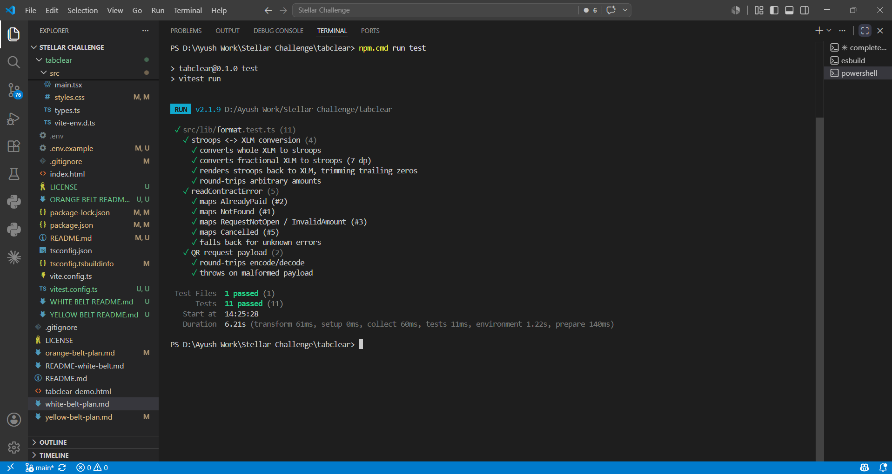

# Tabclear — Orange Belt (Level 3)

[](https://github.com/aayushyadavji/TabClear/actions/workflows/ci.yml)

> Level 3 evolves Tabclear from a demo into a **production-shaped dApp**: atomic
> on-chain settlement via **inter-contract communication**, contract + frontend
> **tests**, a **CI/CD pipeline**, a one-shot **deployment workflow**, a
> **mobile-responsive** UI, and real **event streaming**.

See the [main README](README.md) for the overview and the
[Yellow Belt README](YELLOW%20BELT%20README.md) for Level 2.

---

## The headline: atomic settlement in ONE transaction

Yellow Belt paid a request in **two** steps (an XLM payment via Horizon, then a
separate `mark_paid` on Soroban) — which could leave state inconsistent if the
second step failed.

Orange Belt introduces **`tabclear-settlement`**, a second contract that settles a
request **atomically** by cross-calling two other contracts in a single transaction:

```
customer ──invoke──> tabclear-settlement.pay_request(id, payer)
                          │
                          ├──> tabclear-requests.get_request(id)          (cross-contract read)
                          ├──> XLM SAC.transfer(payer → merchant, amount)  (token contract call)
                          ├──> tabclear-requests.settle(id, payer)         (cross-contract write)
                          └──> emits ("settled", id) → (payer, merchant, amount)
```

Either everything succeeds or the whole transaction rolls back — real inter-contract
communication moving real testnet XLM. `settle` is gated so **only** the wired
settlement contract can call it.

---

## Deployed contracts (Stellar Testnet)

| Contract | Address |
|---|---|
| `tabclear-requests` (v2) | [`CA7XLOMTITAAN464B65OXCNSES73CWBVGXKON54L5LNCHPUQHZE2OZMH`](https://stellar.expert/explorer/testnet/contract/CA7XLOMTITAAN464B65OXCNSES73CWBVGXKON54L5LNCHPUQHZE2OZMH) |
| `tabclear-settlement` | [`CA6WRCKBJFMWMMOAP54U7PONQWT5GVYXYKTQWIF3FI5TUFP7Y4QOIWEE`](https://stellar.expert/explorer/testnet/contract/CA6WRCKBJFMWMMOAP54U7PONQWT5GVYXYKTQWIF3FI5TUFP7Y4QOIWEE) |
| native XLM SAC | `CDLZFC3SYJYDZT7K67VZ75HPJVIEUVNIXF47ZG2FB2RMQQVU2HHGCYSC` |

**Atomic settlement interaction tx:**
[`1421bbf2253adc04f03a24828140a4fb3f0e9f89ec432522ac998a80de4f6704`](https://stellar.expert/explorer/testnet/tx/1421bbf2253adc04f03a24828140a4fb3f0e9f89ec432522ac998a80de4f6704)
— a single transaction whose events show the `transfer`, `paid`, and `settled`
events firing together.

---

## Requirements → where each is met

| Requirement | Where |
|---|---|
| **Advanced smart contract development** | `tabclear-requests` v2: status enum, timestamps, `paid_by`/`paid_at`, pagination, cancel, admin gating (`contracts/tabclear-requests/src/lib.rs`) |
| **Inter-contract communication** | `tabclear-settlement.pay_request` cross-calls requests + the XLM SAC atomically (`contracts/tabclear-settlement/src/lib.rs`) |
| **Event streaming & real-time updates** | `getContractEvents` polls `created`/`paid`/`settled` across both contracts; live feed + toasts (`src/lib/contract.ts`, `src/components/RequestsPanel.tsx`) |
| **CI/CD pipeline** | `.github/workflows/ci.yml` — contract tests + wasm build, frontend typecheck + tests + build |
| **Deployment workflow** | `scripts/deploy.sh` — build → deploy both → initialize → wire → smoke-test → print env |
| **Mobile responsive frontend** | bottom tab bar + full-screen sheets under 820px (`src/styles.css`, `src/components/Dashboard.tsx`) |
| **Error handling & loading states** | typed wallet errors + contract error taxonomy (`readableError`, `readContractError`); loading/empty/error states in the UI |
| **Tests (contracts + frontend)** | 18 Rust tests (`contracts/**/src/test.rs`) + 11 vitest tests (`src/lib/format.test.ts`) |
| **Production-ready architecture** | `src/lib` split by responsibility: `stellar.ts`, `contract.ts`, `settlement.ts`, `format.ts` (pure, testable); all config from env |
| **Documentation & demo** | this README + demo video below |

---

## Contract API (v2)

`tabclear-requests`:

| Function | Purpose |
|---|---|
| `initialize(admin)` | one-time setup |
| `set_settlement(addr)` | admin wires the settlement contract allowed to call `settle` |
| `create_request(merchant, amount, memo)` | opens a request, stores `created_at`, emits `created` |
| `get_request(id)` / `list_requests(start, limit)` | reads (paginated, newest-first) |
| `settle(id, payer)` | **settlement-contract-only**; records `paid_by`/`paid_at`, emits `paid` |
| `cancel_request(id)` | merchant voids an unpaid request |
| `mark_paid(id)` | legacy manual settle (kept for back-compat) |

`tabclear-settlement`:

| Function | Purpose |
|---|---|
| `initialize(requests, token)` | wire the requests contract + XLM SAC |
| `pay_request(id, payer)` | atomic read → transfer → settle → emit `settled` |
| `requests_address()` / `token_address()` | read the wiring |

---

## Run it locally

```bash
# 1. Contracts — test + build (Linux/macOS, or Windows via the gnu toolchain)
cd tabclear/contracts
cargo test --workspace
stellar contract build

# 2. Deploy + wire both contracts to testnet (prints the env block)
cd ..
IDENTITY=<your-funded-testnet-key> ./scripts/deploy.sh

# 3. Frontend
npm install
cp .env.example .env     # paste VITE_REQUESTS_ID + VITE_SETTLEMENT_ID from step 2
npm run test             # 11 vitest tests
npm run dev              # http://localhost:5173
```

> **Windows note:** this machine's MSVC linker lacks the Windows SDK, so build the
> contracts with `RUSTUP_TOOLCHAIN=stable-x86_64-pc-windows-gnu`. CI runs on Linux,
> so no toolchain juggling there.

---

## Screenshots

| Mobile responsive UI | Test output (11 passing) |
|---|---|
|  |  |

**CI/CD pipeline running:** the green run in the
[GitHub Actions tab](https://github.com/aayushyadavji/TabClear/actions/workflows/ci.yml)
(the badge at the top of this page links to it) — `contracts` job runs the 18 Rust
tests + wasm build, `frontend` job runs the 11 vitest tests + build.

## Demo video

**1–2 min walkthrough:** https://youtu.be/v2wjv_GUS84

## Live demo

**Vercel:** https://tabclear.vercel.app/
