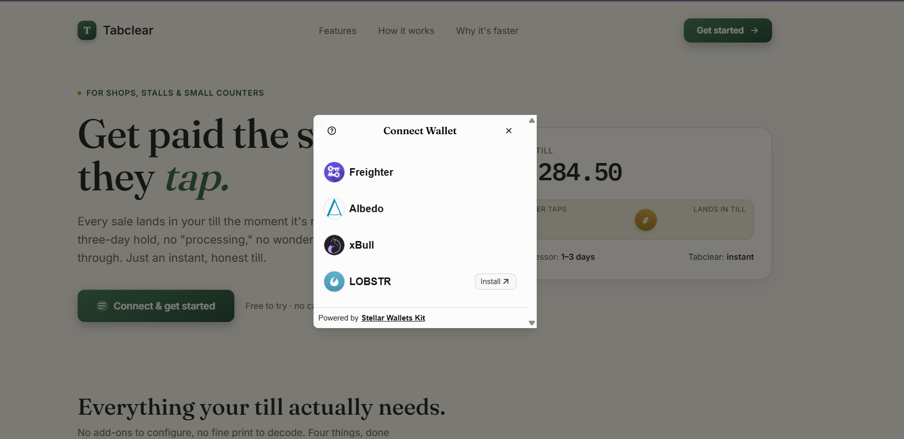

# Tabclear — Instant Merchant Settlement on Stellar

Tabclear is a point-of-sale flow for small merchants: a customer taps to pay and the
merchant's till updates the second the payment confirms — no settlement lag, no
end-of-day batch, no card processor holding the funds.

Built as a **belt progression** on Stellar testnet:

- **White Belt** ✅ — connect a Freighter wallet, view your XLM balance, send a
  testnet payment, and see it settle instantly with real on-chain history.
- **Yellow Belt** ✅ — **multi-wallet** (Freighter/Albedo/xBull/LOBSTR), a deployed
  **Soroban contract** for on-chain **QR payment requests**, contract calls from the
  frontend, **real-time contract events**, and visible **transaction status**.

## Belt guides

- [WHITE BELT README.md](WHITE%20BELT%20README.md) — wallet connect, balance, XLM payment
- [YELLOW BELT README.md](YELLOW%20BELT%20README.md) — multi-wallet, smart contract, events

## Deployed contract (testnet)

| | |
|---|---|
| **Contract address** | [`CD63PPTXJIJCXBVV72JNWOQ4CEKM2AQF2MVMX52OYLFZI6RPG7XRLMW3`](https://stellar.expert/explorer/testnet/contract/CD63PPTXJIJCXBVV72JNWOQ4CEKM2AQF2MVMX52OYLFZI6RPG7XRLMW3) |
| **Sample contract-call tx** | [`916d256b…191ada`](https://stellar.expert/explorer/testnet/tx/916d256b4977ce358b5f7552ce8a6f0444675f1788b6954ff2285a6d5e191ada) (`create_request`) |

## Screenshots

**White Belt**

| Wallet connected & balance | Send payment |
|---|---|
|  |  |

| Payment settled | Activity on dashboard |
|---|---|
|  |  |

Transaction verified on the [Stellar Expert testnet explorer](assets/screenshots/transaction%20explorer.png).

**Yellow Belt**

| Multi-wallet picker | Create request + QR + live events |
|---|---|
|  |  |

| Payment settled (tx status) | Contract call on Stellar Expert |
|---|---|
|  |  |

## Features

**White Belt**
- **Connect / disconnect** a wallet (testnet)
- **Balance display** — native XLM balance from Horizon
- **Fund via Friendbot** — one click to fund an unfunded testnet account
- **Send XLM** — build → sign → submit, with clear success/failure feedback
- **Instant confirmation** — transaction hash + Stellar Expert link, balance auto-refreshes
- **Transaction history** — real on-chain payment history for the connected wallet

**Yellow Belt**
- **Multi-wallet** — Stellar Wallets Kit (Freighter, Albedo, xBull, LOBSTR)
- **On-chain QR payment requests** — `tabclear-requests` Soroban contract
- **Contract calls from the UI** — create request, look up, mark paid
- **Real-time contract events** — `created` / `paid` streamed into the dashboard
- **Transaction status** — pending / success / failed pills throughout

## Tech stack

- **Frontend:** Vite + React + TypeScript
- **Wallets:** Stellar Wallets Kit (`@creit.tech/stellar-wallets-kit`)
- **SDK:** `@stellar/stellar-sdk` (Horizon for classic payments, Soroban RPC for the contract)
- **Contract:** Rust + `soroban-sdk` (`contracts/tabclear-requests/`)
- **Network:** Stellar Testnet

## Getting started

```bash
npm install
npm run dev
```

Then open the printed local URL (usually http://localhost:5173).

See [WHITE BELT README.md](WHITE%20BELT%20README.md) and
[YELLOW BELT README.md](YELLOW%20BELT%20README.md) for full setup, contract deploy
steps, prerequisites, and demo walkthroughs.

## License

[MIT](LICENSE) © Aayush Yadav
